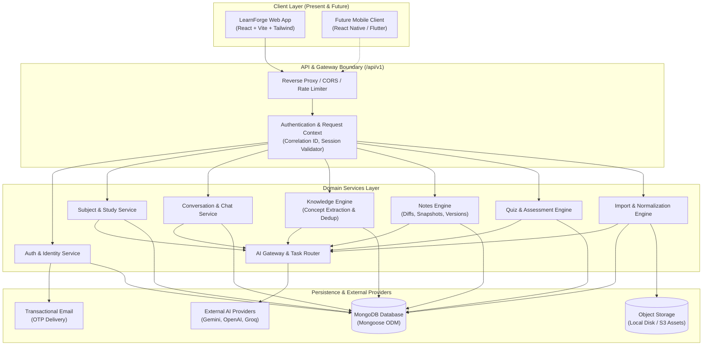
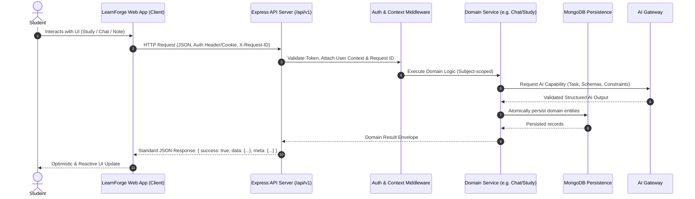
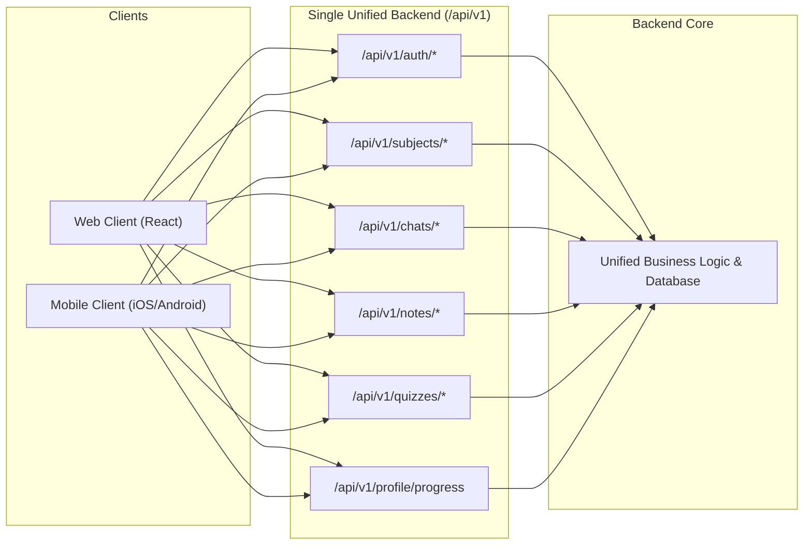
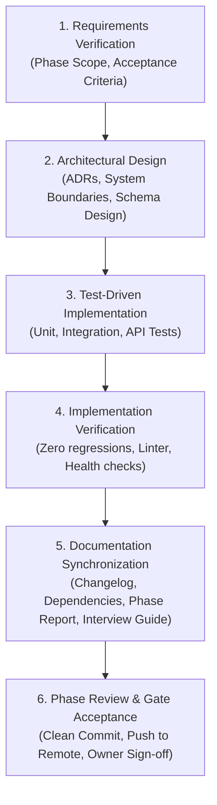

# LearnForge — System Architecture Diagrams

This document contains canonical Mermaid architecture diagrams illustrating the structural organization, execution workflows, client-server decoupling, and engineering processes of **LearnForge**.

---

## 1. High-Level System Architecture

---

## 2. Frontend / Backend Separation

---

## 3. Future Mobile API Relationship

---

## 4. Engineering & Documentation Lifecycle

